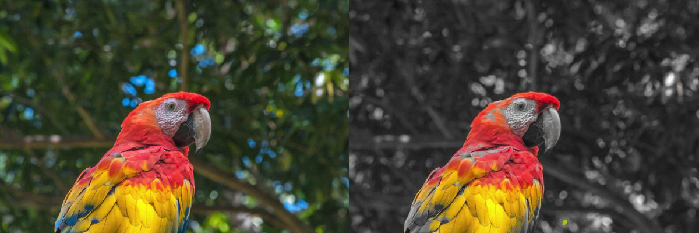

## Concepts

- What are colors?
- Pixels https://en.wikipedia.org/wiki/Pixel#/media/File:Pixel_geometry_01_Pengo.jpg
- Image coordinate system
- RGB color model https://hslpicker.com/
- How many colors are there?
- Grayscale and luminance https://en.wikipedia.org/wiki/Grayscale
- Color distance
- Pillow library: https://pillow.readthedocs.io/en/stable/reference/Image.html
- Demo: color channel manipulation
- HSL color model / conversion

## Demo: Color Channel Manipulation

```py
from PIL import Image

im = Image.open("bird.jpg")
output = Image.new(im.mode, im.size)

for y in range(im.height):
  for x in range(im.width):
    (r, g, b) = im.getpixel((x, y))

    # convert colors to red-only
    output.putpixel((x, y), (r, 0, 0))

output.save("output.jpg")

```



## Starter Code

- Setup

  ```py
  from PIL import Image

  im = Image.open("bird.jpg") # load input image
  output = Image.new(im.mode, im.size) # make blank output image with same dimension as input

  for y in range(im.height):
    for x in range(im.width):
      (r, g, b) = im.getpixel((x, y))

      # your code here

      output.putpixel((x, y), (r, g, b))

  output.save("output.jpg") # save output image
  ```

- Dimensions

  ```py
  im.height # image height in pixels
  im.width # image height in pixels
  ```

- Get pixel value:

  ```py
  (r, g, b) = im.getpixel((x, y)) # get rgb values at position x, y
  ```

- Set pixel value:

  ```py
  im.putpixel((x, y), (r, g, b)) # set rgb values at position x, y
  ```

## Problems

Write a program to convert an image to grayscale.

Write a program to convert an image to black-and-white.

Write a program to convert any non-red pixels (pixels that are more green or blue than they are red) to grayscale.

Write a program to rotate an image `n` degrees about its center.

Write a program that increases an image's saturation to the maximum amount.

Write a program that shift an image's hue by a certain number of degrees in HSL.
