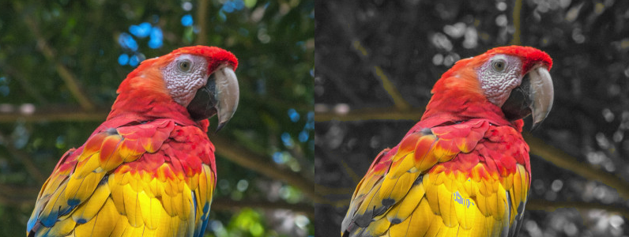

## Concepts

- What are colors?
- Pixels https://en.wikipedia.org/wiki/Pixel#/media/File:Pixel_geometry_01_Pengo.jpg
- Image coordinate system
- RGB color model https://hslpicker.com/
- How many colors are there?
- Grayscale and luminance https://en.wikipedia.org/wiki/Grayscale
- Color distance
- Pillow library: https://pillow.readthedocs.io/en/stable/reference/Image.html
- Demo: color channel manipulation
- HSL color model / conversion

## Demo: Color Channel Manipulation

```py
from PIL import Image

im = Image.open("bird.jpg")
output = Image.new(im.mode, im.size)

for y in range(im.height):
  for x in range(im.width):
    (r, g, b) = im.getpixel((x, y))

    # convert colors to red-only
    output.putpixel((x, y), (r, 0, 0))

output.save("output.jpg")

```



## Starter Code

- Setup

  ```py
  from PIL import Image

  im = Image.open("bird.jpg") # load input image
  output = Image.new(im.mode, im.size) # make blank output image with same dimension as input

  for y in range(im.height):
    for x in range(im.width):
      (r, g, b) = im.getpixel((x, y))

      # your code here

      output.putpixel((x, y), (r, g, b))

  output.save("output.jpg") # save output image
  ```

- Dimensions

  ```py
  im.height # image height in pixels
  im.width # image height in pixels
  ```

- Get pixel value:

  ```py
  (r, g, b) = im.getpixel((x, y)) # get rgb values at position x, y
  ```

- Set pixel value:

  ```py
  im.putpixel((x, y), (r, g, b)) # set rgb values at position x, y
  ```

## Problems

**Grayscale:** Write a program to convert an image to grayscale.

**Black and White:** Write a program to convert an image to black-and-white.

**Color Channels:** Write a program to convert any non-red pixels (pixels that are more green or blue than they are red) to grayscale.

**Transformation:** Write a program to rotate an image `n` degrees about its center.

**Saturation:** Write a program that increases an image's saturation to the maximum amount.

**Hue:** Write a program that shift an image's hue by a certain number of degrees in HSL.

## Concepts (Advanced)

- Color quantization https://en.wikipedia.org/wiki/Color_quantization
- Dithering https://tannerhelland.com/2012/12/28/dithering-eleven-algorithms-source-code.html
- Kernels and convolution https://setosa.io/ev/image-kernels/

## Problems (Advanced)

**Quanitzation:** Choose a color palette of 8 colors. Write a program that converts an image to use this color palette by finding the closest color in the palette to each color in the input image.

**K-Means:** Write a program that generates a color palette for an image automatically using k-means clustering. https://en.wikipedia.org/wiki/K-means_clustering

*You should work in grayscale for the following problems*.

```py
im = Image.open("bird.jpg").convert("L") # load input image in grayscale

l = im.getpixel((x, y)) # (grayscale image) get lightness value at position x, y

im.putpixel((x, y), l) # (grayscale image) set lightness value at position x, y
```

**Sharpen Kernel:** Write a program that sharpens an image with the sharpen kernel. https://en.wikipedia.org/wiki/Kernel_(image_processing)

**Edges Kernel:** Write a program that finds the edges in an image using the Sobel filter. https://en.wikipedia.org/wiki/Sobel_operator

**Random Dither:** Write a program that performs random dithering.

**Good Dither:** Write a program that performs Floyd-Steinberg dithering.
