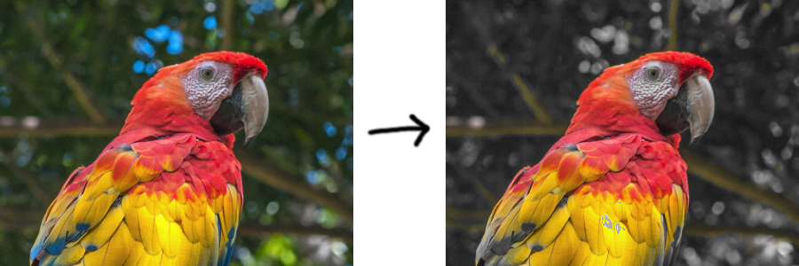

## Internal Representations:

We don't have to use the variables that we get from the user in the `__init__`
method. For example, we can keep track of `totalInches` internally, instead of
`feet` and `inches` separately, which can simplify our code.

```py
class Height:
    def __init__(self, feet, inches):
        self.totalInches = feet * 12 + inches

    def __repr__(self):
        inches = self.totalInches % 12
        feet = self.totalInches // 12
        return f"{feet}'{inches}\""

    def __add__(self, inches):
        return Height(0, self.totalInches + inches)

    def __sub__(self, inches):
        return Height(0, self.totalInches - inches)

    def __eq__(self, other):
        return self.totalInches == other.totalInches

    def __lt__(self, other):
        return self.totalInches < other.totalInches

    def __le__(self, other):
        return self.totalInches <= other.totalInches

h = Height(5, 11)
print(h + 4) # 6'3"
print(h == Height(5, 5) + 6) # True
print(h < Height(6, 0)) # True
```

## If Expressions:

Python has a special syntax that allows `if` and `else` to be used as
expressions, meaning that they can be used on the right-hand side of a variable
definition. See details here:
https://docs.python.org/3/reference/expressions.html#conditional-expressions

So, intead of writing this:

```py
if self.hours == 0:
    hoursStr = "12"
else:
    hoursStr = str(self.hours)
```

You could write this:

```py
hoursStr = "12" if self.hours == 0 else str(self.hours)
```

## Bar Chart Coding Interview Practice

Print a bar chart based on the numbers in the list `numbers` where each number
`n` in the list gets its own column with `n` `X` characters in it.

For the numbers (1, 4, 2, 7, 3) the output should be:

```
   X
   X
   X
 X X
 X XX
 XXXX
XXXXX
```

## What is `self`

Linus had a nice explaination for the `self` keyword the other day in class:

> When we make an object in Python and assign it to a variable, we can use that
> variable name to access the fields and methods of the object. For example, if
> we made a new `Point` object `p = Point(5, 0)` then we can access `p.x`,
> `p.y`, `p.distanceTo(...)`, etc. **But** when we write methods for the `Point`
> class, we don't know ahead of time what our point variable going to be named,
> so we have to use the special placeholder name `self` instead.

## Math Methods

Operator overloading:
https://docs.python.org/3/reference/datamodel.html#special-method-names

- `__add__` makes `+` work for custom classes
- `__sub__` makes `-` work for custom classes
- `__eq__` makes `==` (and `!=`) work for custom classes
- `__lt__`, `__le__` makes `<` and `<=` (and `>` and `>=`) work for custom
  classes

```py
class Height:
    def __init__(self, feet, inches):
        # Convert excess inches to feet
        while inches >= 12:
            inches -= 12
            feet += 1

        # Borrow inches from feet when inches are negative
        while inches < 0:
            inches += 12
            feet -= 1

        self.feet = feet
        self.inches = inches

    def __repr__(self):
        # Displays Height(5, 6) as 5'6"
        return f"{self.feet}'{self.inches}\""

    def totalInches(self):
        return self.feet * 12 + self.inches

    def __add__(self, inches):
        return Height(self.feet, self.inches + inches)

    def __sub__(self, inches):
        return Height(self.feet, self.inches - inches)

    def __eq__(self, other):
        return self.feet == other.feet and self.inches == other.inches

    def __lt__(self, other):
        return self.totalInches() < other.totalInches()

    def __le__(self, other):
        return self.totalInches() <= other.totalInches()

h = Height(5, 11)
print(h + 4) # 6'3"
print(h == Height(5, 5) + 6) # True
print(h < Height(6, 0)) # True
```

## Immutable Classes

```py
class Height:
    def __init__(self, feet, inches):
        # Convert excess inches above 11 to feet
        while inches >= 12:
            inches -= 12
            feet += 1

        self.feet = feet
        self.inches = inches

    def __repr__(self):
        # Displays Height(5, 6) as 5'6"
        return f"{self.feet}'{self.inches}\"" # Need to escape double quote

    def addInches(self, inches):
        # Make a new height with inches added on
        # __init__ will handle the case where the new inches exceed 12
        return Height(self.feet, self.inches + inches)

h = Height(5, 11)
print(h.addInches(4))
```

Notice that `addInches` doesn't update the `self.inches` field of the current
object; instead it creates a new object with the inches added in. This is an
example of **immutable** class design, where the methods of an object don't
change the existing object, but instead create a new object.

If we were designing `Height` to be a **mutable** class, then we would have to
change `addInches` to update the existing object instead of returning a new one.

```py
def addInches(self, inches):
    self.inches += inches
```

We'll explore mutable classes later in this course.

## Object-Oriented Programming Terms

- **Objects**: Structures that combine data and functionality (methods)
- **Methods**: Functions that are attached to a value
- **Classes**: The categories that objects belong to
- **Instance**: An object is an "instance" of a class if the object belongs to
  that class category
- **Fields**: Variables that are stored inside an object

The `self` variable is used inside the methods of a class to specify which
fields and methods are attached to the instances of the class. For example, if
we were making a `Car` class and we wanted to set the field `speed` of the car
to 10, we'd do `self.speed = 10`. If we wanted to access the speed later on in
another method, we'd use `self.speed` to get it. Make sure to put `self` as the
first argument to each method you define for your classes.

We call methods using the `.` operator in Python, where the object we're calling
the method on comes before the dot and the name of the method comes after, with
arguments in parenthesis (see the call to `distanceTo` and `originDistance` in
the code below).

## Custom Classes

```py
import math

class Point:
    def __init__(self, x, y): # __init__ defines how a new point is created
        self.x = x # store x as a field on the new Point object
        self.y = y # store y as a field on the new Point object

    def __repr__(self): # __repr__
        return f"Point({self.x}, {self.y})"

    def originDistance(self): # custom method that takes 0 arguments (not counting self)
        # calculates the distance from this point to the origin (0, 0)
        return math.sqrt(self.x ** 2 + self.y ** 2) # distance formula

    def distanceTo(self, other): # custom method that takes 1 argument (not counting self)
        # calculates the distance between self and other
        dx = self.x - other.x # calc difference between x of self and other
        dy = self.y - other.y # calc difference between y of self and other
        return math.sqrt(dx ** 2 + dy ** 2) # distance formula

p = Point(3, 4)

print(p) # prints "Point(3, 4)"

p.x # 3
p.y # 4
p.originDistance() # 5.0

o = Point(1, 2)
p.distanceTo(o) # 2.8284271247461903
```

## Image Processing

- What are colors? https://en.wikipedia.org/wiki/Color
- Pixels
  https://en.wikipedia.org/wiki/Pixel#/media/File:Pixel_geometry_01_Pengo.jpg
- Image coordinate system
  https://dsp.stackexchange.com/questions/35925/why-do-we-use-the-top-left-corner-as-the-origin-in-image-processing
- RGB color model https://rgbcolorpicker.com/
- How many colors are there?
- Grayscale and luminance https://en.wikipedia.org/wiki/Grayscale
- Color distance https://en.wikipedia.org/wiki/Color_difference#sRGB
- Pillow library: https://pillow.readthedocs.io/en/stable/reference/Image.html

## Demo: Color Channel Manipulation

This demo preserves the colors for pixels that are "red-ish" (more red than blue
or green), and sets the other pixels to grayscale. In the demo image below, we
see that the reds and yellows in the bird are preserved, while the blues and
greens of the background are removed.

```py
from PIL import Image

im = Image.open("bird.png")
output = Image.new(im.mode, im.size)

for y in range(im.height):
    for x in range(im.width):
        (r, g, b) = im.getpixel((x, y))

        if (r < g or r < b):
            l = round((r + g + b) / 3)
            r = l
            g = l
            b = l

    output.putpixel((x, y), (r, g, b))

output.save("output.png")
```



## PIL API

- Dimensions

  ```py
  im.height # image height in pixels
  im.width # image width in pixels
  ```

- Get pixel value:

  ```py
  (r, g, b) = im.getpixel((x, y)) # get rgb values at position x, y
  ```

- Set pixel value:

  ```py
  im.putpixel((x, y), (r, g, b)) # set rgb values at position x, y
  ```

- Use the [`colorsys`](https://docs.python.org/3/library/colorsys.html) module
  to convert between RGB and HSL.

```py
import colorsys # put this at the top of your code along with the PIL import

(h, s, l) = colorsys.rgb_to_hls(r, g, b) # get HSL from RGB
(r, g, b) = colorsys.hls_to_rgb(h, l, s) # get RGB from HSL
```

## Review

- Printing
- User input
- Primitives: booleans, numbers (ints and floats), strings, `none`
- Type conversions
- Variable names
- Numerical operators
- Compound operators
- Boolean operators
- Comparison operators
- String addition and format strings
- Conditionals, nested conditionals
- For and while loops
- Functions: arguments, arity, side-effects, return values, early return
- Variable scope
- Lists: indexing, negative indexing, slicing, length, `append`, `reverse`,
  `sort`
- String `split` and `join`
- Tuples and destructuring
- Files: reading and writing
- Random numbers

## Links

[Python tutorial](https://docs.python.org/3/tutorial/index.html)

[Python library docs](https://docs.python.org/3/library/index.html)

[Python textbook](https://runestone.academy/ns/books/published/fopp/index.html?mode=browsing)
